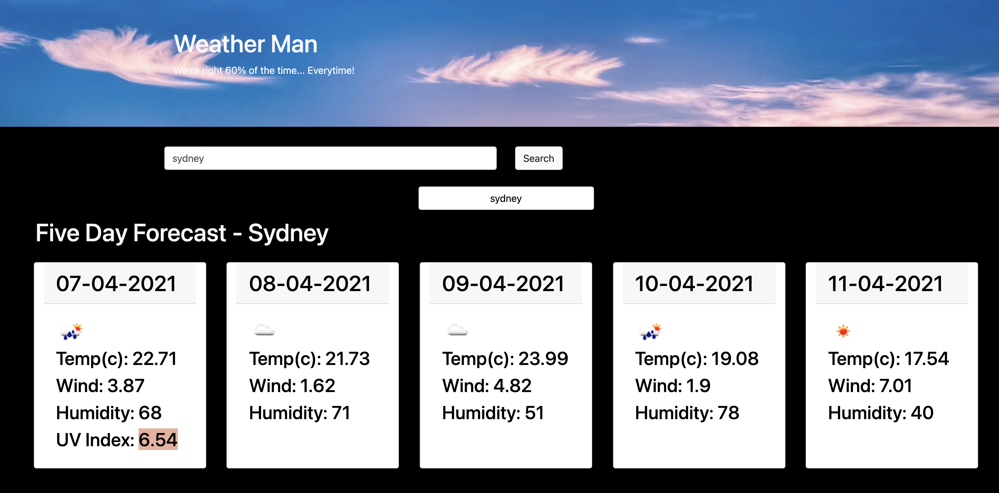
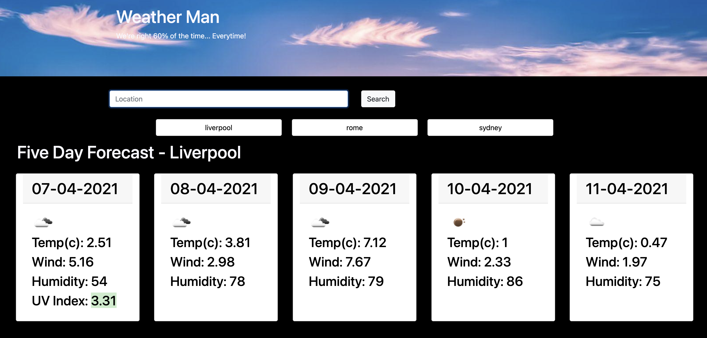

# Weather App

Build a weather dashboard that will run in the browser, uses server side APIs, uses local storage and features dynamically updated HTML and CSS.

# User Story

AS A traveler
I WANT to see the weather outlook for multiple cities
SO THAT I can plan a trip accordingly

# Acceptance Criteria

GIVEN a weather dashboard with form inputs

WHEN I search for a city
THEN I am presented with current and future conditions for that city and that city is added to the search history

WHEN I view current weather conditions for that city
THEN I am presented with the city name, the date, an icon representation of weather conditions, the temperature, the humidity, the wind speed, and the UV index

WHEN I view the UV index
THEN I am presented with a color that indicates whether the conditions are favorable, moderate, or severe

WHEN I view future weather conditions for that city
THEN I am presented with a 5-day forecast that displays the date, an icon representation of weather conditions, the temperature, the wind speed, and the humidity

WHEN I click on a city in the search history
THEN I am again presented with current and future conditions for that city

# Features

## Weather Search

When a user searches for a city, the weather for the next 5 days is displayed and todays weather card also contains the UV rating.

## Stored Searches

When a user searches for a city, the city is then saved to search history. New searches are added to the top of the list, unless the search has already been completed before. The search history is limited to 5 searches.

# Link to Git Hub

https://github.com/mp2626/weather_app

# Link to Site

https://mp2626.github.io/weather_app/

# Programming Languages/APIs

* HTML
* CSS
* JavaScript
* BootStrap
* JQuery
* Moment JS

# Authors
Contributor - Michael Perrin
